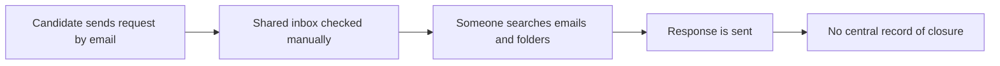

# GDPR Compliance Gap Analysis

## Project Overview

This mini-project looks at GDPR process gaps in a small recruitment agency in Dublin.

The focus is not legal advice. It is a Business Analyst-style review of how personal data is currently handled, where the weak spots are, and what a realistic improved process could look like for a small team.

## Data & Approach

This is a case-study-style analysis, not a review of a real company.

No real company data or personal data was used. The scenario is based on realistic SME workflows, especially the way small recruitment teams often rely on email, spreadsheets, and shared folders.

The goal was to reflect common GDPR process gaps in a practical way.

## Why This Project Matters

SMEs often handle personal data every day, but they do not always have a formal compliance team or a dedicated system for GDPR work.

For a recruitment agency, this is especially important because CVs, ID documents, candidate assessment notes, right-to-work checks, and payroll details are part of normal daily work.

The problem is common because small teams usually start with email, Excel, and shared folders. Those tools work for a while, then become harder to control as the business grows.

This analysis matters because the risk is not always that people are ignoring GDPR. Sometimes the team is doing the work, but cannot clearly prove what happened later.

## Business Context

Greenline Recruitment is a fictional small recruitment agency with around 18 staff.

They place office admin, finance, customer service, and short-term temp candidates into small and medium-sized businesses around Ireland.

The team stores and uses personal data such as:

- candidate CVs
- ID documents
- candidate assessment notes
- client contact details
- right-to-work checks
- some payroll details for temporary workers

At the moment, most of this is handled through Outlook, shared folders, Excel trackers, and a few individual consultant folders. There is no formal GDPR request system.

If a candidate asks for their data to be deleted or updated, it usually comes into a shared inbox. Someone on the team picks it up, but there is no consistent tracker showing what was requested, who handled it, or whether it was closed properly.

## Assumptions

| Assumption | Reason |
|---|---|
| The company has no dedicated compliance officer | This is common for a small recruitment agency of this size |
| Candidate data is stored across email, Excel, and shared drives | The current process is based on manual tools rather than a central system |
| GDPR requests are low volume but important | The team may only get a few each month, but missing one still creates risk |
| The business wants a practical fix, not a large compliance platform | A heavy tool would likely be too expensive and hard to maintain |

## Scope and Limitations

This review focuses on operational GDPR handling, not a full legal audit.

Included in scope:

- GDPR request handling
- consent tracking
- data storage visibility
- retention issues
- basic audit evidence
- simple reporting metrics

Out of scope:

- legal policy drafting
- supplier contract review
- full cybersecurity assessment
- detailed DPIA work
- formal advice on lawful basis

The aim is to show how the process could be improved from a Business Analyst point of view.

## Problem Summary

Greenline has grown a bit, but its data process has not really grown with it.

The team can usually find what they need, but it depends too much on memory and manual searching. A candidate's CV might be in the recruitment inbox, saved in a shared folder, attached to an old client email, and also mentioned in an Excel tracker.

That becomes a problem when someone asks:

"Can you delete my data?"  
"What information do you hold about me?"  
"Can you stop contacting me?"

The request may be handled, but the business cannot always prove what happened. There is no single place showing the request, owner, due date, actions taken, and final response.

Consent is also unclear. Candidates normally agree to be contacted when they apply, but Greenline does not always record when consent was given, what it covered, or whether the candidate later withdrew it.

This is not a case of people being careless. The process is just too spread out.

## Current State vs Improved State

| Area | Current State | Improved State |
|---|---|---|
| Data storage | CVs, notes, and documents are spread across inboxes, shared folders, and Excel | A simple data register shows what data is held, where it is stored, and why |
| GDPR requests | Requests are handled through email when someone notices them | Requests are logged, assigned, tracked, and closed with evidence |
| Consent | Consent is mostly assumed from applications or emails | Consent date, source, purpose, and withdrawal status are recorded |
| Retention | Old CVs and documents are kept because no one reviews them regularly | Records have review dates and old files are checked on a set schedule |
| Reporting | Managers have no easy view of open or overdue GDPR tasks | A basic tracker shows request status, overdue items, and missing consent records |

## Key Gaps Identified

1. Personal data is stored in too many places  
   Greenline does not have a full view of where candidate and client data is stored. This makes it harder to respond accurately to access, deletion, or correction requests.

2. GDPR requests are not properly tracked  
   Requests come through email and are handled manually. If the inbox is busy or someone is on leave, a request could be delayed or missed.

3. Consent is not backed up with clear evidence  
   Consent is often collected in practice, but there is no reliable field or document showing when it was collected, what it covered, or whether it has changed.

4. Ownership is unclear  
   There is no named person responsible for each request. The process depends on whoever sees the email first, which is risky when deadlines matter.

5. Retention checks are inconsistent  
   Old CVs and ID documents are kept longer than needed because there is no regular review of retention dates.

6. Audit evidence is weak  
   If the Data Protection Commission asked how a request was handled, the team would need to search emails and folders manually. That would take time and may still not give a complete answer.

## Key Insight

The main issue is not the number of GDPR requests Greenline receives.

The bigger issue is lack of control. The team may be doing the right thing, but they do not have a reliable way to show what happened.

Simple visibility would solve a lot here: one tracker, clear ownership, due dates, and saved evidence.

## Business Impact

The biggest risk is not only a possible GDPR fine. The more immediate issue is that Greenline cannot confidently prove what happened with someone's data.

There is also an efficiency problem. Staff may spend time searching through old emails and folders just to answer one basic request. That time could be spent speaking with candidates or clients.

The customer trust issue is important too. If a candidate asks to have their data deleted and then receives another job email months later, the agency looks disorganised. Even if it was a genuine mistake, it damages confidence.

For a small recruitment agency, reputation matters. Candidates and clients need to feel that personal information is being handled properly.

## Recommendations

The recommendation is not to buy a large compliance platform straight away. For this size of company, that would probably be too much.

A better first step is to introduce a lightweight GDPR request tracker. This could be built in SharePoint Lists, Airtable, Monday.com, or a simple low-cost SaaS tool.

The tracker should capture:

- date received
- request type
- candidate or client name
- assigned owner
- due date
- current status
- action taken
- evidence or notes
- closure date

Greenline should also create a basic data register. This does not need to be complicated. It should show:

- what personal data is held
- where it is stored
- why it is needed
- who can access it
- how long it should be kept

For consent, the candidate tracker should include a few clear fields:

- consent received
- consent date
- consent source
- consent purpose
- consent withdrawn, if relevant

A monthly review would also help. The operations manager or office manager could check overdue requests, old records, and missing consent fields once a month. It is a small habit, but it would make the process much more controlled.

## Proposed Solution Snapshot

The solution does not need to be complicated. A shared tracker with clear ownership would be enough to give the team much better visibility.

The tracker could sit in SharePoint Lists, Airtable, Monday.com, or another lightweight tool the team already understands. The important part is that every request is logged, assigned, followed up, and closed with evidence.

Example GDPR request tracker:

| Request ID | Date Received | Request Type | Owner | Due Date | Status | Evidence |
|---|---|---|---|---|---|---|
| GDPR-001 | 04 Mar 2026 | Data deletion | Office Manager | 03 Apr 2026 | In progress | Email saved; folders being checked |
| GDPR-002 | 11 Mar 2026 | Data access | Senior Consultant | 10 Apr 2026 | Open | Awaiting inbox and folder search |
| GDPR-003 | 18 Mar 2026 | Consent withdrawal | Recruitment Admin | 17 Apr 2026 | Closed | Candidate record updated; confirmation sent |
| GDPR-004 | 22 Mar 2026 | Data correction | Office Manager | 21 Apr 2026 | Closed | Updated CV record saved |

This gives the business a simple answer to basic questions:

- What requests are open?
- Who owns them?
- What is due soon?
- What proof do we have that the request was completed?

## Simple Process Flow

### As-Is Process

Current process in plain English:

Request comes in -> someone notices it -> they search manually -> response is sent -> no reliable tracking

### To-Be Process

Improved process in plain English:

Request comes in -> logged in tracker -> assigned to owner -> checked properly -> action completed -> evidence saved -> request closed

## Improved Flow Table

| Step | What Happens | Why It Helps |
|---|---|---|
| 1. Log request | Every GDPR request is added to the tracker on the day it arrives | Stops requests sitting unnoticed in the inbox |
| 2. Assign owner | One person is responsible for follow-up | Removes confusion about who is handling it |
| 3. Check data locations | Email, folders, Excel, and candidate records are checked | Gives a clearer view of what data exists |
| 4. Save evidence | Notes, confirmations, and actions are saved against the request | Makes the process easier to prove later |
| 5. Close request | Status is updated once the response is sent | Gives managers a simple view of completed work |

## Success Metrics

These are simple measures the business could actually use:

- Number of open GDPR requests
- Number of overdue GDPR requests
- Average days to close a request
- Percentage of candidate records with consent date recorded
- Number of records past retention review date
- Number of requests closed with evidence attached

The goal is not to create a huge dashboard. The goal is to give the team enough visibility to spot problems early.

## Final Reflection

Right now, Greenline is managing GDPR mostly through email, Excel, and people remembering what needs to be done.

That might work when the team is small, but it is fragile. If one person leaves, goes on holiday, or misses an email, the process can break down.

The biggest risk is that the company cannot easily prove what data it holds, where it sits, or how a request was handled.

The quickest win would be a simple GDPR request tracker and a basic data register. That gives the business more control without forcing the team into a heavy system they probably would not use properly.

This project helped me see GDPR as a process issue as much as a compliance issue. The business does not just need rules. It needs a simple way for people to do the right thing consistently.
