# GDPR Compliance Gap Analysis

## Project Overview

This repository documents a GDPR request-management gap analysis for a small recruitment agency. It analyzes a manual process built around email, spreadsheets, and shared folders, then defines a lightweight future-state workflow for tracking requests, ownership, consent evidence, retention actions, and audit history.

Key capabilities:

- Current-state and future-state process analysis.
- GDPR request tracker template.
- Practical gap assessment for ownership, status visibility, consent, retention, and evidence.
- Mermaid process-flow artifacts.
- Success metrics for operational compliance tracking.

## Architecture

This is a documentation and process-design repository, not a deployed software service. The architecture describes the proposed operating model for a future lightweight workflow tool.

```mermaid
flowchart LR
    request["GDPR request received"]
    intake["Central request intake"]
    classify["Classify request type and due date"]
    owner["Assign owner"]
    evidence["Collect evidence and consent records"]
    action["Complete request action"]
    audit["Record outcome and audit trail"]
    metrics["Review SLA and gap metrics"]

    request --> intake
    intake --> classify
    classify --> owner
    owner --> evidence
    evidence --> action
    action --> audit
    audit --> metrics
```



End-to-end pipeline:

1. A GDPR request is received through email or a web form.
2. The request is logged in a central tracker with requester, type, due date, and owner.
3. The owner gathers candidate data, consent records, and required evidence.
4. The action is completed and documented.
5. The audit trail is updated with status, timestamps, decision notes, and evidence links.
6. Metrics are reviewed to identify delays, missing proof, and process gaps.

## Tech Stack

| Layer | Tooling | Purpose |
|---|---|---|
| Documentation | Markdown | Requirements, process analysis, recommendations |
| Diagrams | Mermaid | Current-state and future-state workflow diagrams |
| Data artifact | Markdown tracker template | Request tracking and audit evidence structure |
| Runtime | Not applicable | No executable application is included |

## Data Flow

1. Ingestion: GDPR requests enter the process from email, forms, or direct contact.
2. Processing: requests are classified by type, due date, data scope, owner, and required action.
3. Storage: the proposed tracker stores request status, ownership, evidence links, and completion notes.
4. Transformation: operational data is summarized into SLA, backlog, and evidence-completeness metrics.
5. Serving: process documents and tracker views support team review, audit preparation, and continuous improvement.

## Setup Instructions

### Prerequisites

- Markdown viewer or editor
- Mermaid-compatible renderer for diagrams

### Environment Variables

No environment variables are required. `.env.example` is not needed because the repository has no runtime service.

### Docker Setup

Docker is not required for this documentation repository.

### Local Run Steps

Open the Markdown files in an editor or viewer. Start with `GDPR_Compliance_Gap_Analysis.md`, then review the artifacts under `artifacts/`.

## Project Structure

```text
.
|-- GDPR_Compliance_Gap_Analysis.md  # Main analysis document
|-- artifacts/
|   |-- process-flow-mermaid.md      # Current and future process diagrams
|   |-- tracker-template.md          # GDPR request tracker template
|-- README.md                        # Repository guide
```

## Key Components

### ETL Pipeline

No ETL job is implemented. The proposed operational data flow is manual intake into a tracker, followed by structured review and metric summaries.

### Streaming Pipeline

No streaming pipeline is included. Request status updates are modeled as tracker updates.

### dbt Models

No dbt models are included. If the tracker is later stored in a database or warehouse, useful models would include request SLA status, overdue requests, consent-proof completeness, and monthly request volumes.

### API Layer

No API is included. A future workflow tool could expose endpoints for request creation, assignment, evidence upload, status transition, and audit-log retrieval.

### Data Quality Checks

Recommended checks include required owner, request type, due date, lawful-basis notes, evidence link, completion date, and final status.

## Testing

There are no automated tests. Review quality is maintained by checking that the process flow, tracker fields, gaps, recommendations, and metrics remain consistent across documents.

## Troubleshooting

| Issue | Fix |
|---|---|
| Mermaid diagram does not render | Use a Markdown viewer with Mermaid support |
| Tracker fields feel incomplete | Compare against the gap analysis and add missing ownership, SLA, or evidence fields |
| Recommendations feel too broad | Tie each recommendation back to a documented process gap |
| Metrics are hard to calculate | Ensure the tracker has due date, completion date, status, owner, and request type |

## Future Improvements

- Convert the tracker template into a spreadsheet or database table.
- Add a sample dataset for request volumes and SLA reporting.
- Define API requirements for a future request-management tool.
- Add evidence retention and deletion workflow rules.
- Add a lightweight dashboard specification for backlog, SLA, and risk metrics.
