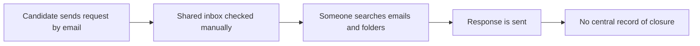
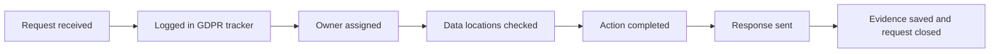

# Process Flow

This shows the current manual GDPR request flow and the improved version proposed for Greenline Recruitment.

## As-Is Process

## To-Be Process

## Why This Helps

The improved flow gives the team a clear owner, a due date, and a record of what happened. It is still simple enough for a small business to manage.
